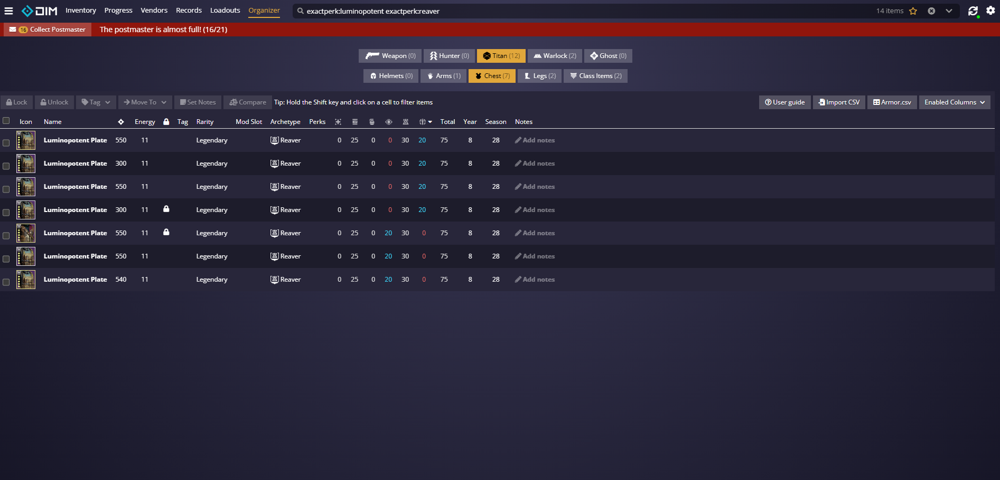
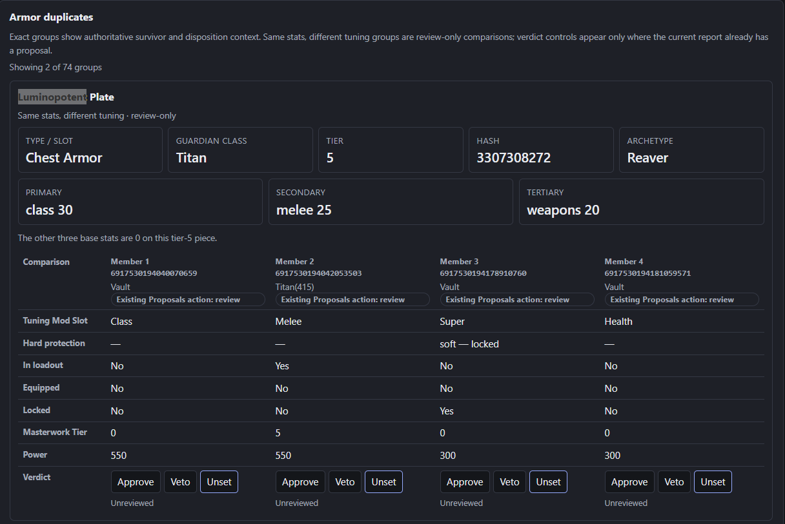

# Issue #110 real-export validation

These owner-approved screenshots validate the same-stat Armor duplicates view
against DIM using a fresh real export. No CSV export is stored here.

DIM Organizer shows four Titan Luminopotent Plate / Reaver pieces with the same
base distribution: Class 30, Melee 25, Weapons 20, with the other three base
stats at 0.

The vault-cleaner report shows the corresponding four-member authoritative
same-stat group, including its four distinct Tuning Mod Slots: Class, Melee,
Super, and Health.

The vault owner explicitly approved publishing the visible item instance ids.
They are opaque item locators rather than authentication credentials.
