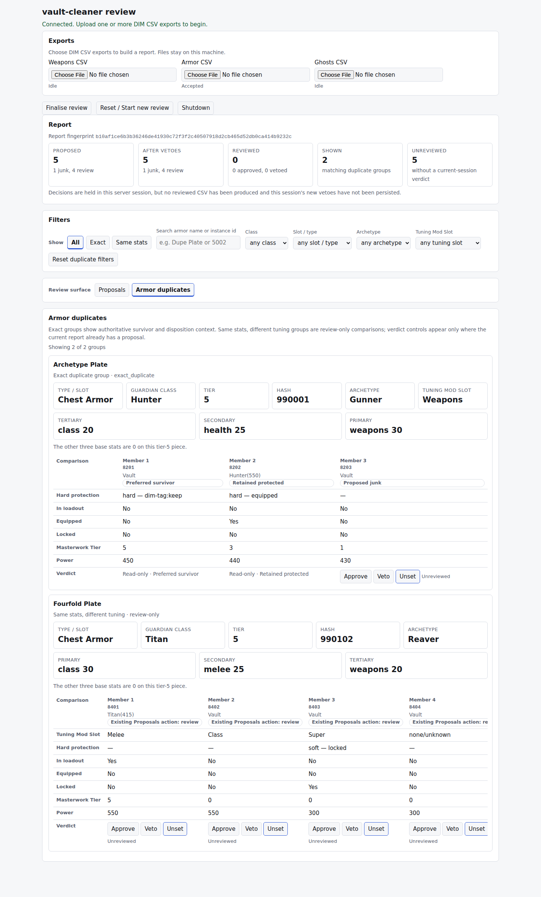
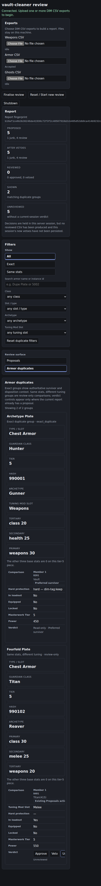
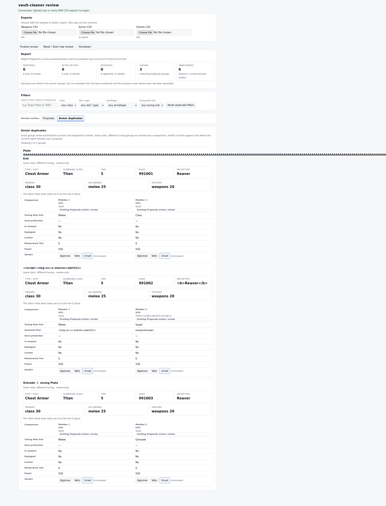
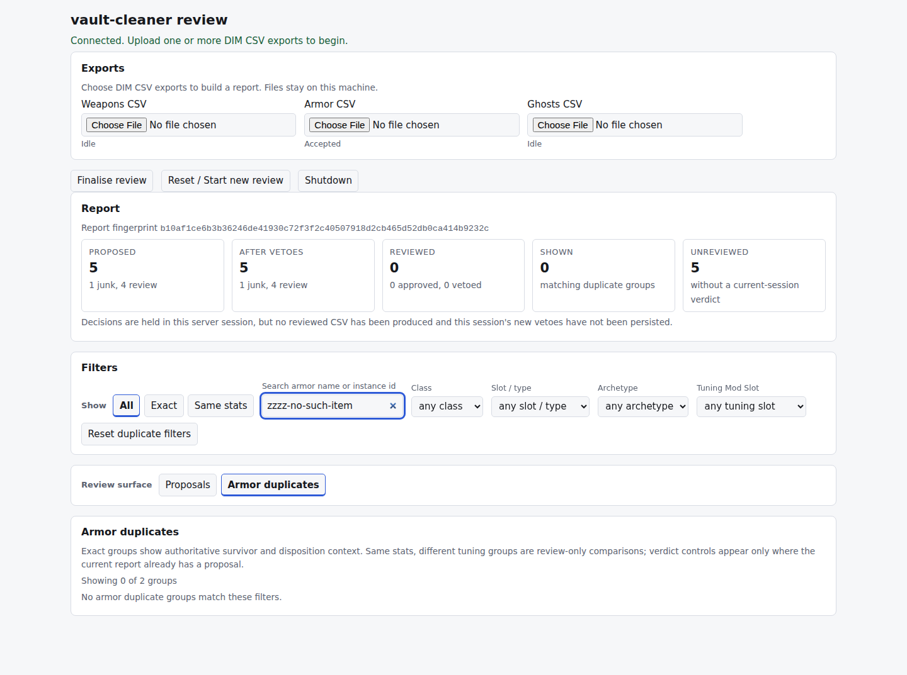

# Issue #113 baseline evidence

Rendered captures of the **current** Armor duplicates view, taken before any
design change, so the #113 decision record compares against what actually ships
rather than against a reading of the source.

Everything here is fake fixture data. No real export, account identifier, or
owner-approved instance id appears in any capture — unlike
[issue-110](../issue-110/README.md), which published owner-approved real ids.

## How these were produced

The packaged review server was started against committed fixtures with
`no_wishlists=True`, driven headless with Playwright, and captured at the two
viewport sizes [browser-verification.md](../../browser-verification.md) asks
for, in both appearances.

| Capture | Viewport | Appearance | Export |
|---|---|---|---|
| `baseline-duplicates-desktop-light.png` | 1440×900 | light | mixed: `armor_duplicates_ui.csv` + `armor_same_stat_four_ui.csv` |
| `baseline-duplicates-desktop-dark.png` | 1440×900 | dark | same mixed export |
| `baseline-duplicates-narrow-light.png` | 390×844 | light | same mixed export |
| `baseline-duplicates-narrow-dark.png` | 390×844 | dark | same mixed export |
| `baseline-empty-state-desktop-light.png` | 1440×900 | light | mixed export, search narrowed to no matches |
| `baseline-hostile-text-desktop-light.png` | 1440×900 | light | hostile armor names, generated |

Proposed treatments, for comparison against the baseline above:
`alternative-a-scoped-summary-line.png`, `alternative-b-distributed-counts.png`,
and the interactive `count-treatments.html`.

The mixed export is the two committed fixtures concatenated: one exact
duplicate group of three members, one same-stat group of four. The hostile
export was generated for this pass and is not committed; it reuses the string
set from `weapons_hostile.csv` — script injection, spreadsheet formula
injection, RTL override, and a 180-character unbroken name.

## What the desktop capture shows

The report tile row reads `PROPOSED 5 · AFTER VETOES 5 · REVIEWED 0 · SHOWN 2 ·
UNREVIEWED 5`. Four of those tiles count items; `SHOWN` counts groups, but only
on this surface. The tile label and its visual weight are identical either way —
only the small sub-caption changes. Directly below, `Showing 2 of 2 groups`
states the same number again in different words.

Two label defects are visible and are tracked in #118:

- The exact group's sub-line renders `Exact duplicate group · exact_duplicate`,
  leaking a raw internal enum.
- A row headed **Hard protection** shows `soft — locked` for the locked member
  of the four-member group.

The four-member group also demonstrates the scanability problem #113 was raised
about: the fourth member's badge is clipped mid-word to
`Existing Proposals action: re`, while members 1–3 show the full text.

All four members carry a live `review` proposal and render Approve / Veto /
Unset controls, so a same-stat group is **not** a verdict-free surface even
though the close pass selects no survivor.

## What the narrow capture shows

Only **Member 1** of each group is visible. The comparison table is wrapped in
`.scroller` and scrolls correctly, so nothing is lost — but reaching members 2,
3 and 4 requires horizontal scrolling inside the table. A comparison view that
shows one member at a time cannot be used to compare, which is the strongest
single argument for transposing members from columns to rows.

The five report tiles stack to roughly an eighth of the page height before any
group content is reached, and the report fingerprint overflows its line.

## What the hostile-text capture shows

**Rendering is inert.** No dialog fired, no injected `` element reached the
DOM, and names render as text at full length. Script and formula payloads are
displayed, not executed.

**Layout is not.** A 180-character unbroken name gives the document a scroll
width of **2266px at a 390px viewport**, against 549px for the same page with
ordinary names. The cause is the group heading: `article.armor-group h3`
computes `overflow-wrap: normal` and reports a scroll width of 2229px inside a
316px box, which propagates up through `.armor-group` and `main.wrap` to the
document. `review.css` already applies `overflow-wrap: anywhere` to
`.armor-member-heading .sub` and `.detail dd`; the group heading was missed.

The report fingerprint (`<code id="vc-fingerprint">`) overflows independently at
524px wide, which is the 549px baseline figure above. Both are tracked in #118.

## Empty state

Narrowing the search until nothing matches renders `Showing 0 of 2 groups`
followed by `No armor duplicate groups match these filters.`

Two observations. The count line is at its *most* useful here — `0 of 2` is the
one case where the already-filtered denominator still tells the reader something
— which is worth preserving when the line is replaced. And the empty message
names no filter and offers no way to widen, so a reviewer who has stacked a
search, a kind and three facets cannot tell which one emptied the list. That is
a small gap rather than a defect, and it is recorded for #119 rather than #118.

## Keyboard and focus

Verified by real keyboard navigation rather than programmatic focus, which does
not trigger `:focus-visible`. Tabbing to the first verdict control gives
`outlineWidth: 3px`, `outlineStyle: solid`, `outlineColor: rgb(47, 91, 215)`,
`outlineOffset: 1px`, and `matches(':focus-visible') === true` — the global rule
at `review.css:105`. The skip link at `review.css:63` is present and reachable.

This is baseline behaviour that must not regress; an earlier code-only reading
wrongly flagged it as missing.

## Reproducing

The capture and probe harnesses were throwaway and are not committed. Rebuild
them from `tests/test_server_browser.py`, whose `live_server` fixture is the
same server-on-a-thread pattern; the only additions needed are
`page.emulate_media(color_scheme=...)` and `page.set_viewport_size(...)`, since
the bootstrap token is single-use and one page must be reused across
appearances.
