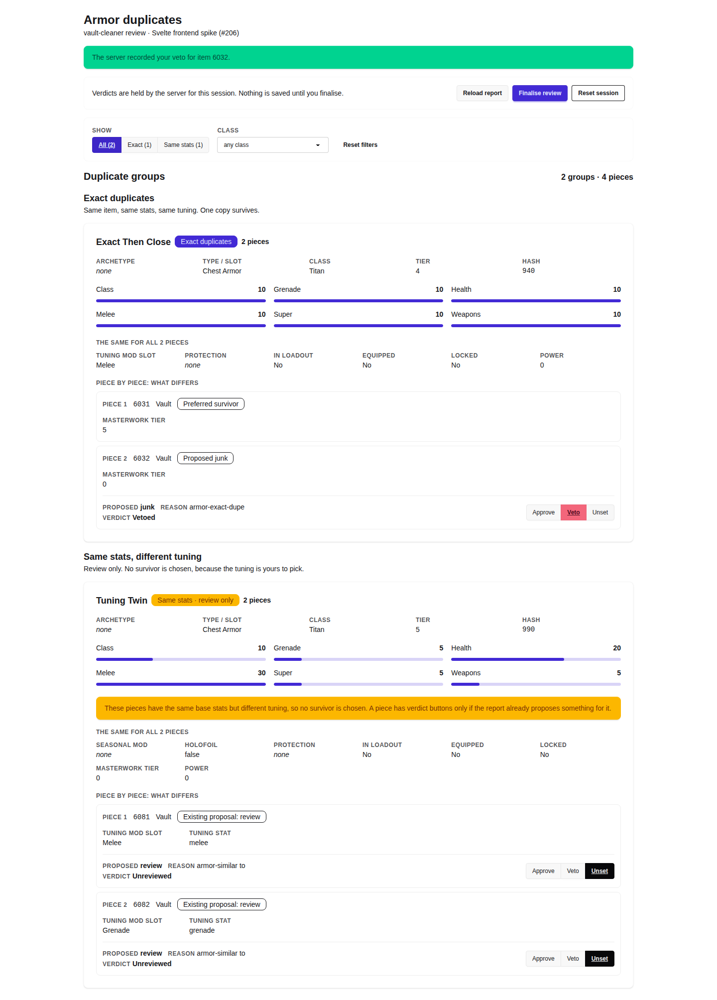
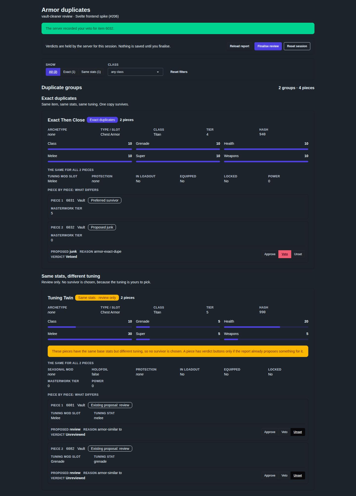
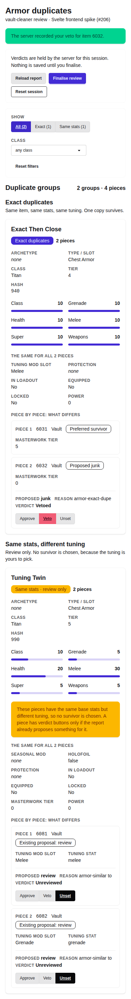
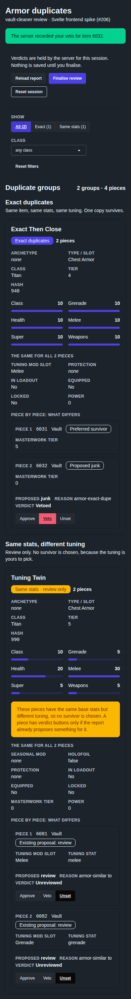

# Frontend framework decision

Status: **NO-GO**, reviewed 2026-10-10 (implementation 2026-10-09), after
[#209](https://github.com/tonym999/vault-cleaner/issues/209)'s approved
presentation-performance gate. [Evidence](evidence/issue-209/README.md) records
every invocation and the failed visual comparison. This decision began with
[#206](https://github.com/tonym999/vault-cleaner/issues/206) on 2026-10-04;
its original tables and evidence remain below. No production code changes.
Migration drafts are in [section 9](#9-migration-ticket-drafts); draft 5 was
carried out by #209. No issue was created or edited during implementation.

The frozen #206 proofs and [evidence](evidence/issue-206/README.md) remain
rerunnable. #209's [spike](../spikes/issue-209/README.md) measures a copied
frontend with production beside it, using only tracked synthetic and sanitised
fixtures. Nothing in either spike ships.

## 1. Recommendation

**NO-GO.** Keep the current page. The 2026-10-09 performance candidate
improves navigation through whole-group rendering containment, but fails the
approved gate in both final invocations: acknowledgement to DOM remains
1.1 ms and 0.5 ms slower. Acknowledgement to settled fails by 1.1 ms in the
first final invocation and passes in the second; passing only once does not
meet the bar. The visual gate also fails: skipped off-screen group content is
blank inside the required top-2,400-px captures. A keyboard jump focuses the
last control outside the viewport. The unchanged S15 correctness proof also
did not complete within 900s during implementation; an independent execution
later completed with unexplained narrow-light contrast coverage (2862 incomplete
targets, only 116 measured). Independent gate runs pass once, then fail A3 and
B3 again, so the two-consecutive-invocation bar still fails. These gaps and changes were
not accepted by the owner. The issue permits explicit owner acceptance of a
remaining gap; this record does not infer it.

The candidate is preserved as a failed measured spike, with no further
optimization after the stop condition. Svelte 5 + TypeScript + Vite remains
the stack investigated by #206; migration is not released by this result.
The proposed architecture remains:

- **Svelte 5 with TypeScript, built by Vite 8.** Plain Svelte, not SvelteKit.
- **Tailwind CSS 4 with daisyUI 5** for styling, on native HTML controls.
  No JavaScript component library.
- **The browser reads the existing schema-version-1 envelope** and projects
  it in typed TypeScript. No new server route and no view-model.
- **Flask serves three built files** (`.html`, `.js`, `.css`) with stable
  names from its fixed allow-list, under the **unchanged** CSP.
- **Node is a development and CI tool only.** The built files are committed
  beside the other UI resources, so an installed wheel and a Python-only
  contributor never need Node.

The H1–H9 table preserves #206’s architectural results. H5 now records
#209’s NO-GO result; its earlier layout checks alone do not release migration:

| Gate | Requirement | Result | Evidence |
| --- | --- | --- | --- |
| H1 | The slice shows what the server says | Pass. Every required value equal for four fixtures, without and with verdicts, at 1440 and 390 px. S15 additionally compares every value in all 74 sanitised groups (158 members, 3401 value/role assertions per width), and all five real-upload spirit signatures; exact Seasonal Mod and positive Holofoil still rest on S1's overlay. Scope and Class options match for all nine sequences, including the real Hunter-to-Exact drop; the negative control fails | [S1](evidence/issue-206/README.md#s1-information-parity-gate-h1), [S15](evidence/issue-206/README.md#s15-real-scale-gates-h1-h4-h5) |
| H2 | Untrusted values inert; ids and hashes opaque | Pass, in two passes. With all 602 strings replaced: no element created, no dialog, no violation, ids byte-identical in the DOM, and no member has verdict buttons. With the three values that decide eligibility kept (574 strings replaced): the same, and the id is byte-identical in the verdict request body | [S2](evidence/issue-206/README.md#s2-hostile-content-gate-h2), [source rules](evidence/issue-206/README.md#source-rules-gates-h2-h8) |
| H3 | Acknowledged state only; no replay; correct across finalise, reset and disconnect | Pass. The already-open page reaches the frozen state with the revision pair unchanged | [S3](evidence/issue-206/README.md#s3-acknowledged-state-only-gate-h3), [S4](evidence/issue-206/README.md#s4-finalise-reset-disconnect-gate-h3) |
| H4 | Contract section 7 met; focus survives a verdict | Pass, with one stated change of mechanism (`aria-disabled`, [section 4](#4-design)) | [S5](evidence/issue-206/README.md#s5-focus-and-live-regions-gate-h4), [S13](evidence/issue-206/README.md#s13-automated-accessibility-check-gate-h4), [S15](evidence/issue-206/README.md#s15-real-scale-gates-h1-h4-h5) |
| H5 | Narrow layout usable; page never scrolls sideways; real-scale performance condition | **NO-GO.** #209 improves navigation but fails acknowledgement-to-DOM in both final invocations, acknowledgement-to-settled in one, the required visual gate, and keyboard traversal. Original #206 layout results remain historical evidence | [#209 finals](evidence/issue-209/README.md#step-3-and-final-invocation-5--containment), [visual comparison](evidence/issue-209/README.md#gate-d--visual-comparison) |
| H6 | Works from an installed wheel without Node | Pass. Chromium rendered a group and completed a verdict against the wheel, Node absent from the server's `PATH` | [S8](evidence/issue-206/README.md#s8-installed-wheel-in-a-browser-gate-h6) |
| H7 | Auth, Host, Origin and `no-store` unchanged; CSP unchanged or within the approved envelope | Pass with the **unchanged** policy. No addition is used | [S7](evidence/issue-206/README.md#s7-content-security-policy-gate-h7), [S9](evidence/issue-206/README.md#s9-request-envelope-gate-h7) |
| H8 | Maintenance effort is clearly lower | Pass, on structure and not on size. Verdict and reasons in [section 6](#6-comparison) | [S12](evidence/issue-206/README.md#s12-code-comparison-npm-tree-and-licences-gate-h8), [S14](evidence/issue-206/README.md#s14-change-exercises-gate-h8) |
| H9 | A usable development loop | Pass. Verdict and reasons in [section 6](#6-comparison) | [S10](evidence/issue-206/README.md#s10-development-loop-gate-h9), [S11](evidence/issue-206/README.md#s11-type-drift-gate-h9) |

#209 reached the approved stop condition after steps 1–3. No paging,
virtualisation or animation change was built to work around the result. #206’s
first attempt separately stopped at its licence condition; its Amendment 3
records that owner decision.

The exact production policy the recommended stack needs is the one
production has today:

```text
default-src 'none'; script-src 'self'; style-src 'self'; connect-src 'self'; object-src 'none'; base-uri 'none'; frame-ancestors 'none'; form-action 'none'
```

The development experience is the owner's to judge. The try-it command and a
short "make a change yourself" walkthrough are in
[spikes/issue-206/README.md](../spikes/issue-206/README.md).

## 2. Architecture

### The five questions

**1. Where the projection lives: in the browser, from the existing
envelope.** `GET /api/report` and the three mutation routes are used
unmodified. [view.ts](../spikes/issue-206/frontend/src/lib/view.ts) is a set
of pure functions from the adopted envelope to what the components print.

The alternative, a server JSON view-model joined in the browser with
`verdicts`, `state` and `override_status`, was not built. It would add a
route, a Python builder (#137's was 474 lines), a second contract to keep in
step with the first, and the problem #137's review found: `POST
/api/finalize` changes `state` and `override_status` and moves neither
revision, so a view-model cached by revision goes stale. With one envelope,
adopted whole and never cached by revision, that problem has nothing to
attach to
([S4](evidence/issue-206/README.md#s4-finalise-reset-disconnect-gate-h3)).

What the browser computes, each a lookup, a count or wording:

- which verdict a member has, and whether it has an active persisted veto;
- a member's proposal, by looking its id up in its section's `decisions`;
- whether a member has verdict controls, by production's rule
  (`review_ui.js:1209-1212`, `:1289-1295`). An exact member has them when
  its `disposition` and its `proposal_action` agree (`proposed_junk` with
  `junk`, `proposed_review` with `review`) and the section's proposal for it
  carries that action. A same-stat member has them when the section's
  proposal for it is exactly `junk` or `review`. One difference: where the
  values disagree, production's normaliser rejects the whole snapshot
  (`review_ui.js:414-418`), and the slice shows that member without
  controls;
- which comparison fields have one value across a group's members and which
  differ;
- filtering, the scope sentence and facet counts;
- **one derivation the envelope does not carry:** which stat of a tier-5
  piece is primary, secondary and tertiary, from the fixed 30/25/20 spike.
  Production derives it in the browser too (`review_ui.js:806-844`). It
  exists in one language, but it is a candidate for a snapshot field.

No grouping, member order, survivor choice or disposition is computed. The
only ordering in the browser is the alphabetical order of facet options
([source rules](evidence/issue-206/README.md#source-rules-gates-h2-h8)).

**2. How TypeScript types follow Python: hand-written types, checked against
generated samples.** [contract.py](../spikes/issue-206/contract.py) asks the
real server for two envelopes built from a fake fixture and writes them as
JSON. [samples.ts](../spikes/issue-206/frontend/src/contract/samples.ts)
assigns them to the `Envelope` type. A renamed Python field then shows in
three places before any browser runs
([S11](evidence/issue-206/README.md#s11-type-drift-gate-h9)):
`contract.py --check` fails without Node; after regenerating, the type check
fails naming the field and the type; and a unit test fails. The production
build still succeeds, because Vite does not type-check, so the type check has
to be its own CI step.

Generating the types from Python was not chosen: the snapshot is built by
hand-written dictionary code (`report_run.py:360-435`), so there is no single
Python type to generate from.

**3. Filter ownership: the browser.** Filters are pure functions over the
groups the server sent
([filters.ts](../spikes/issue-206/frontend/src/lib/filters.ts)). They work
with the server stopped
([S4](evidence/issue-206/README.md#s4-finalise-reset-disconnect-gate-h3)).

**4. How Flask serves the build: stable file names in the fixed allow-list.**
Vite is configured to write `index.html`, `assets/app.js` and
`assets/app.css`, with no content hash. Every response is already
`no-store`, so a hash would buy nothing, and stable names mean the allow-list
is three literal entries. No request value selects a file, and a file-like
query string changes nothing
([S9](evidence/issue-206/README.md#s9-request-envelope-gate-h7)).

**5. How the wheel gets the build: committed build output, with a freshness
check in CI.** Placed flat in `vault_cleaner/ui/`, the three files match
today's `package-data` globs, so `pyproject.toml` needs no change
([S8](evidence/issue-206/README.md#s8-installed-wheel-in-a-browser-gate-h6)).
A CI job would run `npm ci`, the type check, the unit tests and the build,
and fail if the committed files differ from a fresh build. Two builds on one
machine were byte-identical
([build reproducibility](evidence/issue-206/README.md#build-reproducibility));
across platforms that is not yet measured.

- **A contributor without Node can** install, run the server, run the whole
  Python and browser test suite, change any Python, and check that the
  contract samples are current.
- **A contributor without Node cannot** change the frontend source, or
  regenerate the build after a change to the envelope that the frontend
  reads.

The alternative, building in CI before packaging, would make `pip install`
from a checkout produce a server with no page unless Node were present.

**Not SvelteKit.** One page behind Flask needs no router and no server
runtime. SvelteKit's CSP support adds nonces or hashes "for any inline styles
and scripts it generates" (SvelteKit configuration reference, `csp`, read
2026-10-04), which is for markup SvelteKit renders. This application has
none: Flask serves a static file.

### State ownership

| State | Owner |
| --- | --- |
| Report, groups, members, order, dispositions, proposals, verdicts, revisions, session state, persisted vetoes | Server (unchanged) |
| The adopted envelope, replaced whole on every answer | Browser: `ReviewSession.envelope` |
| The request in flight, connection state, the status and reconciliation messages | Browser: `ReviewSession` |
| Selected kind and facet values | Browser: `ReviewSession.filters` |
| What is rendered | Svelte, from the above. No DOM is built or patched by hand |
| Focus after a report change | Browser: two effects in `App.svelte`, the slice's only direct DOM access |
| Layout at each width, light and dark scheme | CSS |

## 3. Component library comparison

Shortlist from the plan: shadcn-svelte, Skeleton and daisyUI. Each got a
probe page (button, toggle, select, overlay) under the unchanged policy; the
slice was built with one.

Documentation read on 2026-10-04:
[shadcn-svelte, Vite installation](https://www.shadcn-svelte.com/docs/installation/vite);
[Skeleton, Vite and Svelte installation](https://www.skeleton.dev/docs/svelte/get-started/installation/vite-svelte);
[daisyUI, install](https://daisyui.com/docs/install/) and
[themes](https://daisyui.com/docs/themes/).

| | shadcn-svelte 1.7.0 (Bits UI 2.19.5) | Skeleton 5.0.1 | daisyUI 5.7.47 |
| --- | --- | --- | --- |
| What it is | Component source copied into the project by a CLI, built on headless Bits UI | Tailwind design system (classes for buttons, cards, selects) plus interactive Svelte components | A Tailwind plugin: class names on native elements. No JavaScript of its own |
| Svelte 5 | Yes (peer `^5`) | Yes (peer `^5.40`) | Not applicable: it is CSS |
| Licence | MIT. Its default preset also adds an OFL-1.1 web font | MIT | MIT |
| CSP, measured | No violation. Sets styles through the CSSOM | No violation | 31 `img-src` violations from one `data:` texture; cleared by `img-src 'self' data:`, or by a one-line override under the unchanged policy |
| Probe size (page's own JS / CSS) | 203 kB / 32 kB | 66 kB / 143 kB | 1 kB / 61 kB |
| Styling effort | Low per component, but each one adds files to own: 31 files and 717 lines for button, toggle, select and dialog | Low; one theme import | Low; themes for light and dark follow `prefers-color-scheme` from one config line |
| Keyboard and focus | Bits UI provides it for custom widgets (its select is not a native select) | Zag.js provides it for its components; buttons and selects are native | Native elements, so the browser's own |
| Accessibility | From Bits UI, for the widgets it has | From Zag.js, for the widgets it has | Native semantics. Colour contrast is the project's to check: the default dark `primary` measured 4.1:1 |
| Maintenance | Generated files to keep or regenerate; the CLI is interactive and reads a remote registry | A package and many small Zag.js packages to update | One development dependency |

The probe figures and violations are in
[S7](evidence/issue-206/README.md#s7-content-security-policy-gate-h7).

**daisyUI was used, and is recommended.** This page is buttons, a select,
badges, cards and notices. Native controls already give the keyboard, focus
and screen-reader behaviour the design contract requires, and a headless
widget library would add 66 to 203 kB of script to replace elements the
browser provides. daisyUI adds none.

If a later surface needs a widget HTML does not have (a combobox, a menu
with roving focus), **Bits UI is the measured fallback**: it ran under the
unchanged policy with no violation. Prefer native `<dialog>` and `<details>`
first.

**Plain Svelte 5** needs nothing from the policy either: scoped styles are
extracted to the stylesheet, `style:` directives and `style` attributes are
applied through the CSSOM, and transitions use the Web Animations API
([S7](evidence/issue-206/README.md#s7-content-security-policy-gate-h7)).

## 4. Design

### The contract, classified

[docs/review-ui-design-contract.md](review-ui-design-contract.md) binds for
behaviour, accessibility and security. Its presentation is free (owner
decision, #206).

| Contract | Binding or free | In the slice |
| --- | --- | --- |
| Section 1, levels 2 to 4 | Binding | Kept: the server is the authority for data, counts, order, disposition, eligibility, acknowledgement and stale state |
| Section 1, level 1 (the prototype as visual target) | Free | Replaced by daisyUI's default light and dark themes |
| Section 4: tokens, colours, type, spacing | Free | Replaced |
| Sections 5.1 to 5.10: anatomy and composition | Free | Replaced; listed below |
| Section 5.11: controls only on proposal members; read-only members show status | Binding | Kept (S1 asserts it per member) |
| Section 6: icons | Free | No icon is used |
| Section 7: skip link, focusable `h1`, `role="status"` regions, `aria-pressed`, real labels, visible focus, a verdict never rebuilds the focused element | Binding | Kept (S5, S13) |
| Section 8: the page never scrolls sideways; ids, hashes and reasons wrap | Binding | Kept (S2, S6) |
| Section 8: breakpoints and the two-table matrix | Free | Replaced |
| Section 9: an empty state says why | Binding | Kept: four states, each with its reason |
| Section 10 constraints | Binding | Kept. No inline style is hand-written; none is generated either |
| Section 11: no analytics, telemetry or remote resources | Binding | Kept (S7 lists every request) |
| Section 12, questions 1 to 5 | Free | Answered by the choices below |

### Presentation choices changed

1. **Visual target.** daisyUI's `light` and `dark` themes, following
   `prefers-color-scheme`. The dark `primary` is darkened,
   because the default measured 4.1:1 against its text
   ([S13](evidence/issue-206/README.md#s13-automated-accessibility-check-gate-h4)).
   S15 exposed two more contrast defects: the default acknowledged Approve
   label at 4.46:1 and tier-5 outlined stat-role text at 2.39:1 in dark mode.
   Two narrow stylesheet overrides darken success text and lighten outlined
   primary badge text. Their whole-report axe/contrast checks pass after the
   fix; no layout or component markup changed. System fonts; no web font.
2. **The comparison matrix is gone.** Production builds two tables per group
   and switches orientation with container queries. The slice has one
   structure: values that are the same for every piece are listed once under
   "The same for all N pieces"; each piece then shows only what differs.
   Pieces are stacked in one column at every width, and their fields line up
   in a grid, so differences are compared by reading down.
3. **Identical values are a labelled list,** not production's one-sentence
   "Identical across all pieces" line.
4. **Tuning Stat is always shown** (once if shared, per piece if not).
   Production shows it only when it tells apart members with the same slot.
   This is a superset.
5. **Stats.** All six base stats with a bar each, and a `primary`,
   `secondary` or `tertiary` badge on a tier-5 spike. Production shows three
   spike bars and a sentence for the zero stats.
6. **Member status.** One badge: the server's disposition for an exact
   member ("Preferred survivor", "Retained, protected", "Proposed junk",
   "Proposed review"); "Existing proposal: review" or "Comparison only" for a
   same-stat member. Production's separate "Read-only" badge is dropped; a
   read-only member that has a proposal says so in a sentence.
7. **Proposal and verdict.** Every member with a proposal shows the proposed
   action, the reason and the verdict as labelled text, including members
   with buttons. Production shows the reason only on read-only members.
8. **Verdict wording.** `Unreviewed`, `Approved`, `Vetoed`. The persisted
   veto is its own sentence ("A veto saved from an earlier review still
   suppresses this item."), not a suffix.
9. **Absent values** read `none` or `unknown` in italics. Production writes
   `none/unknown` or `—` in the normal face. The server's own `none/unknown`
   sentinel for Tuning Mod Slot is shown as it arrives, in italics.
10. **Group kind control.** Three joined `aria-pressed` buttons with the
    count in the label (contract question 2). The pressed button is also
    bold and underlined, so colour is not the only cue.
11. **Session actions** sit in one card with the session note (contract
    question 5). "Reload report" is new. After finalising, the Finalise
    button is replaced by a download link to `/api/finalized.csv`.
12. **Status and notices** are coloured notices; the three live regions
    keep their roles and are never recreated.
13. **Same-stat notice and section copy** are reworded.
14. **Focus indicator.** One global rule outside the cascade layers: a 3px
    outline in the theme's base-content colour, 2px offset. Independent review
    found daisyUI's component rule overriding the old layered floor: dark
    primary controls had a 2px outline at 2.40:1. S13 recreates that failure
    as a negative control and measures actual Tab-focused links, selects and
    buttons in each state; S15 applies the same check to all 444 controls.
    The corrected primary rings measure 17.72:1 light and 14.75:1 dark.
    This meets the contract's floor and the [3:1 authored focus-indicator
    requirement](https://www.w3.org/WAI/WCAG22/Understanding/non-text-contrast.html)
    (read 2026-10-04). Fills and text colours did not change for this repair.

### One change of mechanism in a binding item

Section 5.11 says verdict buttons are disabled while a request is in flight
and when the session is frozen. The slice marks them `aria-disabled="true"`
and ignores the action, instead of setting the `disabled` property. Measured
in the pinned Chromium: a focused button that becomes `disabled` loses focus
to `<body>`
([S5](evidence/issue-206/README.md#s5-focus-and-live-regions-gate-h4)), which
would break "a verdict repaint never rebuilds the focused element" in
spirit. With `aria-disabled` the focused button is the same node before,
during and after the request. The button stays in the tab order while it is
off. This is a choice for the owner to confirm.

### Screenshots

Fake fixtures, one veto recorded.

| | Light | Dark |
| --- | --- | --- |
| Desktop, 1440 px |  |  |
| Narrow, 390 px |  |  |

The four-member group:
[desktop](evidence/issue-206/four-members-desktop-light.png),
[narrow](evidence/issue-206/four-members-narrow-light.png).

### Sanitised report screenshots

Each image is only the top 2,400 px of the report (the first groups), not
all 74 groups: full-page captures were about 7 MB each and were removed for
size. The automated geometry and oracle checks cover every group; the
acknowledged verdict on the final group is checked, not pictured.

| Desktop | 390 px |
| --- | --- |
| [Light, top of report](evidence/issue-206/real-desktop-light.png) | [Light, top of report](evidence/issue-206/real-narrow-light.png) |
| [Dark, top of report](evidence/issue-206/real-desktop-dark.png) | [Dark, top of report](evidence/issue-206/real-narrow-dark.png) |

## 5. Browser responsibility keep/remove map

The ten responsibilities and their line ranges are #137's
([docs/review-rendering-architecture.md, section 5](review-rendering-architecture.md#5-javascript-keepremove-map)),
checked again at this head by
[#137's range proof](evidence/issue-206/README.md#keepremove-line-ranges).
`S` is `review_server.js` (1,793 lines); `U` is `review_ui.js` (1,851).
Nothing moves to Python in this design.

| # | Responsibility | Current code | Lines | Becomes |
| --- | --- | --- | --- | --- |
| 1 | Bootstrap and session establishment | `S:81-120`, `S:128-212`, `S:312-413`, `S:1773-1792` | 247 | **Application code,** smaller. State is the fields of `ReviewSession`. Envelope validation (`S:128-212`) becomes the type contract plus one shape check; see the limit in section 8. The start-up code is `main.ts` (8 lines) |
| 2 | Uploads | `S:752-754`, `S:1483-1508`, `S:1760-1767` | 37 | **Application code** (a request) and **framework-managed** markup. Not built in the slice |
| 3 | Report fetching | `S:443-570`, `S:1509-1525` | 145 | **Application code:** `api.ts` (75 lines), typed results instead of thrown errors |
| 4 | Filters, sorts, search, group-kind navigation | `U:211-262`, `U:264-302`, `U:747-802`, `U:846-857`, `S:214-310`, `S:786-832`, `S:1212-1218` | 310 | **Application code** as pure functions (`filters.ts`); the controls and their state display are **framework-managed** |
| 5 | Verdict mutation and acknowledgement | `S:572-584`, `S:899-921`, `S:935-943`, `S:1526-1543`, `S:1556-1564`, `S:1737-1759`, `U:1168-1199`, `U:1790-1815` | 153 | The mutation and its gate stay as **application code** (`ReviewSession.setVerdict`). Every repaint function (`paintRow`, `paintArmorMember`, `setVerdictControlsDisabled`, `refreshMutationControls`) is **removed: framework-managed** |
| 6 | Stale-state reconciliation | `S:760-776`, `S:944-1014`, `S:1544-1555` | 100 | **Application code,** much smaller. `adopt` (`S:944-1014`) decides between rebuild, re-render and repaint; the slice's `#adopt` is three lines, because rendering follows from the envelope |
| 7 | Finalise, download, reset, shutdown | `S:585-601`, `S:777-785`, `S:851-877`, `S:1447-1482`, `S:1565-1736` | 261 | **Application code.** The slice has finalise and reset; download is a link; `--once` and shutdown are not built. The button markup (`S:1447-1482`) is **framework-managed** |
| 8 | Focus and live regions | `S:603-610`, `S:755-759`, `S:833-850`, `S:878-898` | 52 | Live regions are **framework-managed** text in persistent nodes. Focus after a report change is **application code:** two small effects in `App.svelte` |
| 9 | Responsive comparison switching | `U:1641-1648`; `review.css:364-388` | 8 | **Removed.** One structure; CSS only |
| 10 | DOM construction: duplicate groups | `U:304-624`, `U:804-844`, `U:1201-1640`, `U:1773-1788` | 818 | **Removed.** Markup is components; the 321 lines of snapshot normalisation (`U:304-624`) become types and `view.ts` |
| 10 | DOM construction: proposals | `U:87-150`, `U:982-1166` | 249 | **Removed,** in the Proposals ticket. Not built here |
| 10 | DOM construction: shell, metrics, filters, lists | `S:627-746`, `S:1015-1043`, `S:1219-1369`, `S:1370-1446`, `U:892-981` | 467 | **Removed.** The element helpers (`U:892-981`) have no equivalent |
| 10 | DOM construction: DIM search text | `U:626-739`, `U:1650-1771`, `S:1044-1211` | 404 | The query text generation stays as **application code** (pure functions); its panel is **framework-managed.** Not built here |

## 6. Comparison

### Lines

From [S12](evidence/issue-206/README.md#s12-code-comparison-npm-tree-and-licences-gate-h8).
Non-blank lines.

| | Current page | Jinja hybrid (#137) | Svelte slice |
| --- | --- | --- | --- |
| Rendering the duplicates surface | 908 lines of JavaScript | 93 lines of fragment seam in JavaScript, 474 of Python, 187 of templates | 408 of components and markup, 298 of projection, 110 of types |
| Filtering | 152 lines for six filters (#137's E10 count), partly inside the 908 | 62 (two filters) | 102 (two filters, written so a third is one entry) |
| Requests, revisions, reconciliation, lifecycle | not in the 908 | 238 lines that production already has | 277 |
| Imperative DOM calls in that code | 87 | not counted | 0 |

**The slice is not smaller.** Its rendering code is 816 lines against 908,
and the whole slice that runs or is served is 1,420 lines, because it also
contains its own session logic, stylesheet and serving code. The difference
is in kind: no line builds or patches DOM, all of it is type-checked, and
the logic is tested in process.

### The three change exercises

From [S14](evidence/issue-206/README.md#s14-change-exercises-gate-h8).
"Places" are separate edits in shipped code.

| Exercise | Current page | Jinja hybrid | Svelte slice | Incomplete version caught by |
| --- | --- | --- | --- | --- |
| 1. One more per-member value | 1 place (3 if the value were not already normalised), 1 file | 1 place, 1 file | 1 place, 1 file, and 1 test updated | Type check and a unit test |
| 2. One more filter facet | 6 places, 2 files | 9 places, 4 files | 3 places, 2 files, and 1 test added | Type check |
| 3. Reword one verdict state | 1 place | 1 place | 1 place | Type check (a missing state) |

Exercises 1 and 3 are one edit in every codebase, so the slice does not
touch fewer places there. The current page already keeps comparison axes in
one list and verdict wording in one function. What differs is what happens
when the edit is wrong: in the slice the type check names the mistake, and in
exercise 1 an existing unit test had to be updated, which is the test doing
its job. Exercise 2 is where structure shows: the current page threads a
filter through six places in two files.

The hybrid's count for exercise 2 is for adding a facet like its Class
facet. The current page's is where its existing Slot / type facet lives.

### The development loop

From [S10](evidence/issue-206/README.md#s10-development-loop-gate-h9).
Timings are from one machine and vary.

| | Measured |
| --- | --- |
| Cold production build, and a rebuild after a one-line edit | 0.8 s and 0.8 s, including starting npm |
| Output | `app.js` 63 kB (23 kB gzip), `app.css` 57 kB (10 kB gzip), `index.html` 0.4 kB |
| Type check; unit tests | 2.2 s; 1.3 s (32 tests, no browser) |
| One command to first render through the proxy | 1.3 s |
| Save a component to seeing it, no reload, server data kept | under 0.1 s |

The current page has no build and no type check; an edit is seen on reload,
and a mistake is seen at runtime or in the Node-harness tests. The hybrid
has no build either; a template edit is seen on the next request.

### Real scale beside production

[S15](evidence/issue-206/README.md#s15-real-scale-gates-h1-h4-h5) uploads all
893 rows of the tracked sanitised armor fixture without an overlay. Its 9
exact and 65 same-stat groups contain 158 member occurrences (including six
three-member and two four-member groups). Every required value matches the
independent S1 oracle. All nine E10 filter sequences match at both widths;
Hunter is dropped when switching to Exact, whose class options lack it.
All five spirit signatures are shown from the real upload.

All six width/scheme combinations fit without sideways scrolling or clipping;
Tab reaches all 444 controls in order. The final group's acknowledged verdict
keeps the focused node and its viewport position. ScrollY adjusts 20 px as the
status message wraps, through normal scroll anchoring; the target moves 0 px
in the viewport, so there is no visible jump. Whole-document axe and the
independent contrast check pass after the two narrow colour fixes above.

The comparison uses five alternating runs per page on one machine, the same
authenticated session/report, All groups, no Class selection, 1440 px/light.
Production activates its report-ready duplicates control in-page without
human or Playwright dwell. Readiness requires every group to have a laid-out
box, then records the next animation frame. Verdict timing starts when the
JSON body is decoded, before application code resumes; an observer records
the acknowledged control change and its next frame opportunity. These are DOM
and frame-opportunity measurements, not physical display scanout.

| Five-run medians | Svelte slice | Production |
| --- | --- | --- |
| Navigation to every group laid out | 200.0 ms | 150.2 ms |
| Navigation to next animation frame | 212.6 ms | 156.3 ms |
| Acknowledgement to DOM repaint | 17.9 ms | 10.3 ms |
| Acknowledgement to next animation frame | 24.8 ms | 16.7 ms |
| Document elements | 13,143 | 17,138 |

The scope differs: production also constructs the Proposals DOM and both
comparison orientations; the slice has one surface and one structure. Despite
fewer elements the slice is slower in both navigation and acknowledged repaint.
An isolated repeat confirmed the direction. At #206 this changed H5 and the
recommendation to **bounded conditional**; it does not invalidate the passing
information, focus or narrow-layout results. Before switch-over, a focused
presentation change (for example retaining report-scoped projection and
updating only verdict-dependent presentation) must remove the observed
slowdown under this comparison. If that does not suffice, measure paging or
virtualisation of whole groups, preserving within-group simultaneous values,
focus, offline filtering and scope counts. Those alternatives were not built.

### #209: the approved presentation-performance gate

[#209 evidence](evidence/issue-209/README.md) keeps all six implementation gate
invocations: one incomplete instrumentation attempt, then five complete
invocations. Two independent review invocations are appended separately below
and in the evidence: eight total, none discarded.
The corrected proof applies S15’s focus invariant only to the slice, as S15
itself does; production’s disabled-control focus loss remains baseline behavior.
Final invocations 5 and 6 use the same candidate, with no change or excluded run.

Step 0 reproduced the planning direction. Slice/production navigation was
198.1/158.2 ms; acknowledgement to DOM 27.1/9.6 ms. CDP verdict style
recalculation was 138.7/3.1 ms. S15’s first animation-frame stamp runs before
that frame’s style/layout: acknowledgement to its frame was 33.9/17.7 ms,
but acknowledgement to the second nested frame was 176.0/19.9 ms. The new
settled measures include that omitted work; they do not measure display scanout.

Warm Node measurements in final invocations 5/6: JSON.parse 1.297/1.518 ms,
projection 0.342/0.421 ms, value-stable projection 0.790/0.921 ms on a
743,025-byte envelope. Re-derivation’s cost is chiefly lost identity and the
bindings it wakes, rather than the projection’s own execution time.

| Step | Change kept or rejected | Measured result |
| --- | --- | --- |
| 0, invocation 2 | Verbatim copy | All seven comparisons fail; verdict style 138.7/3.1 ms |
| 1, invocation 3 | Complete presented-value equality retains unaffected members/groups and reconciled filters; no revision-keyed cache | Acknowledgement-to-DOM 27.1 → 17.4 ms; script 29.4 → 16.1 ms; navigation still fails |
| 2, invocation 4 | No source change retained. CSSOM probes tried scoped join, all `:has`, disabled rules, theme roots, direct properties, individual color/background rules, simpler selectors and no transitions | Fixed baseline diagnostic: unchanged 59.5 ms vs no-transitions 5.5 ms; removing transitions rejected because intermediate presentation changes. All seven gated comparisons still fail |
| 3, invocation 5 | Whole-group `content-visibility: auto; contain-intrinsic-size: auto 800px` | Navigation 118.0/151.4 ms; verdict style 8.5/3.4 ms; A3 and B3 still fail by 1.1 ms. Stop condition reached |
| Final invocation 6 | Unchanged failed candidate | A3 fails by 0.5 ms; B3 passes this invocation only. No further optimization |

The expensive stylesheet rule is daisyUI’s `.btn` transition: `color,
background-color, border-color, box-shadow, transform`, duration `0.2s`.
Its disabled selectors change those properties on all 435 verdict buttons
when a request starts and when it ends. The fixed diagnostic shows that
removing only scoped join, `:has`, variables, color or background declarations
does not remove the cost. Containment reduces off-screen animated style work
without altering the animation on visible controls: the all-button M4 flip
falls to 3.3/4.0 ms in the final invocations. Every button retains its
`aria-disabled` state and node identity.

| Comparison, ms | Final 5 slice | Production | Result | Final 6 slice | Production | Result |
| --- | --- | --- | --- | --- | --- | --- |
| A1 Navigation to every group box | 118.0 | 151.4 | Pass | 135.5 | 173.1 | Pass |
| A2 Navigation to next frame | 120.9 | 157.7 | Pass | 137.2 | 181.2 | Pass |
| A3 Acknowledgement to DOM | 11.2 | 10.1 | **Fail +1.1** | 11.7 | 11.2 | **Fail +0.5** |
| A4 Acknowledgement to next frame | 11.8 | 20.8 | Pass | 12.5 | 21.6 | Pass |
| B1 Navigation to settled | 135.9 | 165.3 | Pass | 152.4 | 190.8 | Pass |
| B2 Key press to settled | 46.7 | 49.2 | Pass | 43.5 | 56.9 | Pass |
| B3 Acknowledgement to settled | 26.0 | 24.9 | **Fail +1.1** | 19.0 | 26.2 | Pass |

**Gate A fails; gate B fails the two-invocation bar. Gate C fails:** unchanged
S15 did not complete within 900s. It passed the six layout/Tab checks and
1440px light/dark axe and focus laps, then remained in the unchanged animation
settle promise before 390px light. Its browser was closed at the verification
bound, captured traceback preserved, and all owned processes exited. The cause
is unproven; separate bounded diagnostics did not reproduce a nonresolving wait
through 800 successful settle calls. S1–S6, S13 and source rules pass, as do
clean install/type/unit/build checks. There is no completed S15 timing
phase for that historical implementation invocation and no claim that the modified diagnostic is a correctness pass.
Independent review at `cc29041` completed one unchanged S15 execution with
status 1: 1440 light/dark and 390 dark each measure all 581 incomplete contrast
targets, but 390 light reports 2862 incomplete targets and only 116 measured,
with thousands unmeasured. The initial selector-heavy tool output was truncated;
the evidence labels its count summary and preserves the remaining captured
stdout verbatim. It is not a second implementation invocation or evidence that
the historical timeout had a known cause. Gate C remains FAIL.

| Comparison, ms | Review 1 slice | Production | Result | Review 2 slice | Production | Result |
| --- | --- | --- | --- | --- | --- | --- |
| A1 Navigation to every group box | 124.8 | 160.2 | Pass | 124.7 | 157.4 | Pass |
| A2 Navigation to next frame | 125.8 | 166.3 | Pass | 125.8 | 164.2 | Pass |
| A3 Acknowledgement to DOM | 9.4 | 9.7 | Pass | 10.2 | 10.0 | **Fail +0.2** |
| A4 Acknowledgement to next frame | 10.1 | 19.3 | Pass | 10.7 | 18.7 | Pass |
| B1 Navigation to settled | 139.4 | 169.5 | Pass | 139.0 | 172.9 | Pass |
| B2 Key press to settled | 50.7 | 51.1 | Pass | 48.0 | 48.1 | Pass |
| B3 Acknowledgement to settled | 22.7 | 23.3 | Pass | 25.4 | 21.7 | **Fail +3.7** |

The reviewer ran exactly twice: one passes all seven comparisons, the next fails
A3 and B3. The required consecutive passing pair still does not hold. The
candidate and all gate samples/stamps are unchanged; no passing reroll is claimed.

Gate D also fails
all four idle capture pairs and the held-request pair. Off-screen groups render
when approaching the viewport, so a crop taller than the live viewport can
contain blank skipped group bodies. The [baseline image](evidence/issue-209/baseline-desktop-light.png)
and [candidate image](evidence/issue-209/containment-desktop-light.png) show this
explicit difference; candidate byte counts can vary with deferred rendering.
The off-state animation was kept. The first visual run also exposed held-route
cleanup noise; the second releases those routes before closure and still fails
all five comparisons. The third explicitly preserves the fixed difference pair;
the fourth proves default runs leave both PNG hashes unchanged. All four fail
every comparison; none is a passing reroll.

**Traversal also fails.** After two Shift+Tabs the last control is focused but
outside the viewport. Final traversal takes 61 slice steps, largest 46.6 ms, total
1613.7 ms plus navigation 159.1 ms = 1772.8 ms; production takes 59 steps,
largest 31.3 ms, total 1811.9 ms plus navigation 177.5 ms = 1989.4 ms. Neither
has a scrolling Long Task. Slice height grows 60392→60949 px (+557), and a
middle article moves 30118.2→29558.0 px (-560.2) at restored scrollY 0;
production height 58059 and middle top 29816.6 remain fixed. Reading that
article's box may itself affect containment. The proof independently fails drift above 1 px; these figures are not a stability
pass. All three implementation traversal attempts are retained. Their earlier
supplemental desktop-only comparison reports 13137 targets, 74 groups, 444
controls, 0 violations and 582 incomplete contrast rows measured in each theme.
Those desktop-only counts did not reproduce the acknowledged S15 sequence
or its narrow states; independent review accepted this omission as P2. The
corrected supplemental comparator reuses full S15 preparation, then S13's
1440/390 × light/dark settle/contrast/focus sequence and reports unmeasured
counts. A passive wrapper counts the same axe invocation; no extra all-box read
or warm-up lap follows its width changes. This instrumented comparison remains
distinct from primary unchanged S15, which already demonstrates a narrow-light
coverage failure. All-box reads and Tab laps during preparation can themselves
render deferred groups. [Review-fix evidence](evidence/issue-209/README.md#review-fix--four-state-supplemental-comparator)
records the corrected measurement: candidate narrow-light contrast leaves
2746 of 2862 incomplete targets unmeasured (only 116 measured), while #206
measures all 581. Unique axe-target/group counts remain equal, demonstrating
that matching those counts alone does not establish full contrast coverage.

The optimization adds **34 non-blank served-source lines**, counted as S12:
projection +27 (325 total), session +1, stylesheet +6 (67 total). Components,
filtering and types are unchanged; application logic becomes 278 lines and the
served slice plus unchanged #206 serving helper becomes 1,454 lines. Three
added frontend tests bring the unit count to 35. H8 still passes on structure,
with zero hand-written DOM construction/repaint and the same two focus effects;
it does not claim reduced size or that this failed candidate is migration-ready.

### H8: is maintenance effort clearly lower? Yes, on structure

- **(a) No grouping, ranking, survivor or eligibility rule is in both
  Python and the browser.** The browser reads groups, order, dispositions
  and proposals. It does hold knowledge of the server's values, which a
  change on the Python side could silently outdate:
  - the tier-5 stat roles, derived from the 30/25/20 spike (not in Python's
    output at all);
  - the `none/unknown` sentinel for Tuning Mod Slot, copied from
    `duplicate_reference.py:34`;
  - the convention that a Holofoil value of `false` means "not holofoil";
  - the names of enumerated values: the frozen states (`finalized`,
    `closed`), the dispositions and their pairing with `junk` and `review`,
    the override status `active`, and the verdicts `approved` and `vetoed`.

  These are names and conventions, not decisions, but they are a second
  copy. The type contract does not cover them (see H9).
- **(b) No hand-written DOM construction or repaint.** Zero imperative DOM
  calls against 87 in the code it replaces. The listed exceptions are the
  mount point and the focus policy
  ([source rules](evidence/issue-206/README.md#source-rules-gates-h2-h8)).
- **(c) Fewer places in one exercise of three, the same in two,** for the
  reason given above.
- **(d) The remaining application logic is typed and unit-tested without a
  browser:** held responses, stale revisions, a finalise made elsewhere, a
  stopped server, in 32 tests that run in 1.3 s.

It is **not** lower on size, and it adds a toolchain to maintain
([section 7](#7-costs)). If the owner weighs a second toolchain more heavily
than hand-maintained DOM code, this gate is the one to dispute.

### H9: is the development loop usable? Yes

- One command starts it (`dev.py`).
- A component edit was visible against real server data in under 0.1 s,
  without a reload.
- A Python-to-browser type mismatch is caught before runtime, by a
  Python-only check and by the type check. This covers field names and
  field types. It does **not** cover enumerated values: they are typed
  `string`, so a renamed `state`, `disposition`, override `status` or
  `verdict` value passes the type check. The stale-sample check
  (`contract.py --check`) and the unit tests catch those (the reviewer
  renamed each in the samples: the type check passed and the unit tests
  failed every time).
- Nothing in the loop weakens the built product. The Flask server is
  unmodified. The dev proxy presents the server's `Host` and rewrites
  `Origin` only when it is exactly the dev server's own; a foreign `Origin`
  through the proxy is refused with 403. None of it is in the build.
- **In development only, one server check is replaced by a weaker one.**
  Because the proxy always presents the Flask server's `Host`, Flask's
  exact-`Host` check never sees what the browser sent. Its stand-in is
  Vite's `server.allowedHosts`, left at its default. Measured through the
  proxy: a foreign name is refused (403), but `localhost` and any
  `*.localhost` name are accepted (200), where Flask itself answers 400 to
  both.

One caveat: in development the page is served by Vite, so Flask's CSP does
not apply to it. A CSP regression shows only on the built page, so the
built-page checks (S7, S8) must run in CI.

### Development experience, including what was awkward

Good: components read like the page; state is ordinary class fields;
derived values recompute themselves, so "adopt the envelope" is the whole
reconciliation; the session class runs in plain Node for tests; hot reload
keeps the session.

Awkward, each found by a proof:

- **`disabled` drops focus.** Found by S5; needed `aria-disabled`.
- **Tailwind reads class names from any text.** A `data-empty="loading"`
  attribute pulled in daisyUI's `.loading` spinner with a `data:` image.
  The stylesheet also changed with unrelated files until its sources were
  restricted to the shipped source (`app.css`).
- **daisyUI's `data:` texture** needs one override to keep the policy
  unchanged, and its default dark `primary` fails AA contrast.
- **axe cannot judge contrast on daisyUI's buttons, badges and notices**
  (they declare `background-image: none`); the proof measures those itself.
- **lightningcss writes helper properties into the stylesheet** under
  Vite's default CSS target. A modern `cssTarget` stops it
  ([S12](evidence/issue-206/README.md#s12-code-comparison-npm-tree-and-licences-gate-h8)
  checks for traces).
- **Typing JSON samples** means enumerated values are typed `string`, and
  narrowed where they are used.
- **The shadcn-svelte CLI** is interactive, and its default preset adds a
  web font.
- **TypeScript 7 cannot be used yet:** `svelte-check` peers 5 or 6.

## 7. Costs

- **Node in development and CI.** A CI job for `npm ci`, the type check,
  unit tests, the build, the committed-build freshness check, the source
  scan and the licence scan. Python-only work needs none of it.
- **The dependency tree.** 11 direct development dependencies, all pinned
  exactly; no runtime dependency. 76 packages installed, 122 in the
  lockfile (the rest are other platforms' optional binaries). `npm audit`
  reported no vulnerability on 2026-10-04.
- **Licences.** The installed tree is MIT, Apache-2.0, BSD-3-Clause and ISC,
  plus MPL-2.0 for `lightningcss` (required by Vite 8 and Tailwind 4) and
  `axe-core`, both build-time or test-time only. The built output contains
  Svelte, `clsx`, Tailwind and daisyUI, all MIT
  ([S12](evidence/issue-206/README.md#s12-code-comparison-npm-tree-and-licences-gate-h8)).
- **Lines to amend.** `PLAN.md:59` and `AGENTS.md:44` say dev and test
  tooling is pytest, ruff and Playwright. Both need the Node toolchain named
  as development and build tooling, with the runtime set unchanged. The
  `AGENTS.md` setup block needs the npm commands, and the hard rules need
  "never hand-edit the committed build".
- **The 8,653 lines of Node-harness UI tests**
  (`tests/test_review_ui_js.py`, 3,165; `tests/test_server_ui_js.py`, 5,488)
  test the two scripts this replaces. They cannot be kept as they are.
  Behaviour they pin has to be re-expressed as frontend unit tests (logic)
  or Playwright tests (page), surface by surface, before the old scripts are
  deleted. This is the largest single cost of the migration.
- **The production CSP: unchanged.** No `SERVER_CSP` edit is needed, so no
  migration draft carries one. Two things would change that, and each would
  need its own reviewed item: removing the `--fx-noise: none` override
  (`img-src 'self' data:`), or adding a web font (`font-src 'self'`).

## 8. Limits of the evidence

- **No screen reader was run.** Node identity, roles and write counts are
  measured; what is spoken is not.
- **Chromium only,** the pinned headless build.
- **One slice.** Proposals, uploads, metrics, the DIM search panels,
  download handling, `--once` and shutdown were not built.
- **Two of the six duplicate filters** (kind and Class). Search, slot,
  archetype and tuning slot were not written; exercise 2 shows what one more
  costs. The Tuning Mod Slot facet counts pieces and matches any member of a
  same-stat group, which the facet list as written does not express.
- **Less runtime validation than production.** `review_ui.js:304-624`
  validates the snapshot and throws on an inconsistent one. The slice checks
  the envelope's outer shape and trusts the type contract. A malformed
  envelope from the same-origin server would fail in the projection, not
  with a designed message. Every value stays inert either way (S2). The
  migration must decide how much runtime validation to keep.
- **Fixtures have no read-only same-stat member and no exact survivor with
  a later proposal.** Those two cases are covered by unit tests only.
- **Exact-group Seasonal Mod and positive Holofoil still rest on S1's
  in-memory overlay and unit tests.** The sanitised fixture has no exact
  Seasonal Mod and its exact groups have Holofoil `false`; all five spirit
  signatures now come from S15's unmodified upload.
- **The stylesheet half of S12's built-output licence scan is a text match.**
  The JavaScript half reads the bundler's own module list. For the
  stylesheet the bundler lists only the entry file, because Tailwind inlines
  imports itself, so the proof reads the `@import` and `@plugin` lines of
  `app.css`. A package pulled in by an imported stylesheet, rather than
  named in `app.css`, would be missed.
- **The development loop's `Host` check is Vite's, not Flask's** (section 6,
  H9).
- **The hostile overlay is applied between server and page,** because the
  server will not hold such ids. The verdict acknowledgement in S2 is
  therefore simulated; the request body is real.
- **`stale_report` and a finalise elsewhere reach the page on its next
  request.** The page does not poll. "Reload report" is the manual route.
- **The finalise button does not save the CSV;** it shows a download link.
- **Build reproducibility** was measured on one machine.
- **Line counts** compare a spike with production code.
- **Probe package counts** per library were not put in the evidence file;
  the sizes and violations were.
- **Timings** are from one machine. S10 measures one development-loop run;
  S15 uses five alternating runs per implementation and reports medians.
  #209 adds two consecutive final invocations and second nested-frame stamps.
  S15’s verdict stamps exclude style/layout after its first-frame callback;
  they must not stand in for settled rendering. Performance at other widths,
  other machines and reports beyond this 893-row fixture remains unmeasured.
  #209 is NO-GO on the approved bar, despite the improved first screen.
- **The full-page stacked layout is long:** about 61,000 px at desktop and
  101,000 px at 390 px. Every group is tested, but only the top 2,400 px is
  pictured, and no human task-completion or large-report navigation study
  was run.
- **#209 containment defers work.** Off-screen group content renders on approach,
  while all groups remain in the document. Navigation stamps only require
  group boxes, so they cannot establish that every descendant was rendered.
  Traversal, geometry and accessibility coverage are reported separately in
  #209 evidence. In-page find, other browsers, screen readers and human
  navigation are unmeasured. The performance result belongs to #206’s visual
  design and must be repeated after #210’s redesign.
- **The stat-role derivation** stays in the browser because the envelope
  has no field for it.

## 9. Migration ticket drafts

Migration drafts; draft 5 was carried out by #209 with NO-GO. The other
drafts are not released by that result. Each is one ticket, in this order; each
depends on the one before unless it says otherwise. All inherit the hard
rules in `AGENTS.md`, and none changes the envelope, the routes, the session
lifecycle or the CSP.

### 1. M10: frontend toolchain foundation

**Scope.** A `frontend/` Vite project (Svelte 5, TypeScript, Tailwind 4,
daisyUI 5, exact versions, committed lockfile) that builds an empty shell.
The envelope types, `contract.py` and its samples. A CI job: `npm ci`, type
check, unit tests, build, committed-build freshness, contract check, source
scan, licence scan. The freshness check compares the three served files.
`dist/modules.json`, which the licence scan reads, is not served and is not
committed; its paths are relative to the frontend directory, and must stay
so (or the file must be excluded) so that nothing built depends on where the
checkout is. The `PLAN.md` and `AGENTS.md` dependency and setup
lines. The built files committed in `vault_cleaner/ui/` but served by no
route yet.

**Scope rule.** No change to any served page or route.

**Stop if** the committed build is not reproducible in CI across the
project's platforms, or a package falls outside the approved licences.

### 2. M10: session core and the Armor duplicates surface

**Scope.** The typed session (`api`, `ReviewSession`) with unit tests, and
the Armor duplicates surface with all six filters, served at a second
allow-listed path beside the current page. Playwright tests for it, taken
from the behaviours `tests/test_server_browser.py` pins for this surface.
The wheel proof extended to the new files. A decision, with tests, on
runtime envelope validation. Carry #209’s complete-value identity reuse and
unchanged-filter reconciliation only after fresh correctness/performance checks;
never cache state/override status/snapshot by a revision pair. Rendering
containment is a failed candidate here, not an accepted migration pattern.

**Scope rule.** The page at `/` is untouched.

**Stop if** a behaviour in the design contract's binding sections cannot be
met, or the unchanged CSP cannot be kept.

### 3. M10: shell (uploads, report summary, session actions)

**Scope.** Uploads with their status regions, the report summary and
metrics, persisted-override status, finalise with download and `--once`,
download again, reset and shutdown, in the new frontend. Playwright tests
for each.

**Scope rule.** Still at the second path.

**Stop if** download or `--once` handling needs a route or lifecycle change.

### 4. M10: Proposals surface

**Scope.** Search, filters, sort, grouping, bulk verdicts, expanded detail,
and the DIM search panels. Unit tests for sort and grouping; Playwright
tests for the page.

**Scope rule.** Presentation only; proposal order and eligibility come from
the server.

**Stop if** a sort or grouping rule would have to be decided in the browser
beyond what `review_ui.js` already does.

### 5. M10: real-scale presentation performance gate

**Carried out by #209, 2026-10-09: NO-GO.** The approved plan widened the
original scope to settled frames and preserved the #206 design. All seven
comparisons must pass twice consecutively; final invocations fail A3 in both,
B3 in one, the unchanged-appearance gate, and keyboard traversal. No switch-over is released.
The scope below is the original draft, retained as history.

**Scope.** A focused reduction of report-wide presentation work on load and
verdict adoption, with a regression comparison against the current page on
the tracked sanitised report. Start with report-scoped projection and selective
verdict-dependent updates; measure paging or whole-group virtualisation only
if needed. Reuse S15's all-group oracle, filter, focus, keyboard, accessibility
and five-run timing checks. Keep every differing value visible per member.

**Scope rule.** Presentation performance only, on the second path; no schema,
rule, eligibility, lifecycle or protocol change.

**Stop if** the comparison still shows the measured slowdown, or an
optimization sacrifices comparison information, focus, offline filters,
scope counts or CSP. The migration remains conditional and does not switch over.

### 6. M10: switch over and retire the old page

**Scope.** Serve the new frontend at `/`. Delete `review_ui.js`,
`review_server.js`, `review.css`, `review_server.html` and the two
Node-harness test files, after a recorded mapping from each behaviour they
pinned to the test that now pins it. Update `scripts/check_wheel_install.py`
and the documentation.

**Scope rule.** No behaviour is dropped without a line in the mapping saying
why.

**Stop if** the mapping finds a pinned behaviour with no new test.

### 7. M10: final gate

**Scope.** The full Playwright suite against an installed wheel; an
accessibility pass that includes a screen reader, recorded in
`docs/browser-verification.md`; a repeat of #209’s [seven-comparison gate](../spikes/issue-209/proof_gate.py)
and [traversal proof](../spikes/issue-209/proof_traversal.py), including visual
parity and full accessibility coverage, plus a larger fixture
if available through approved sanitisation; and
removal of `spikes/issue-206/` and `spikes/issue-137/` or a note that they
stay as frozen evidence.

**Scope rule.** Verification and documentation only.

**Stop if** the screen-reader pass or the large report finds a defect; that
goes back as its own ticket.
